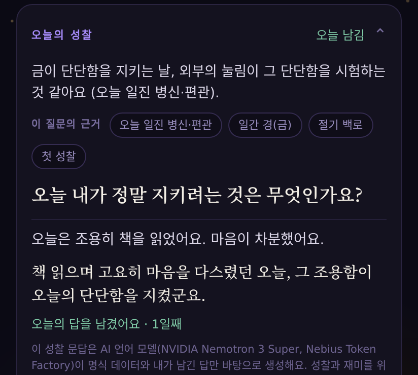

# Daily Reflection (MCP server for Alexa+)

A reflection-journal companion exposed as a **self-hosted MCP server**
(Streamable HTTP, MCP spec 2025-11-25) so an Alexa+ agent — or the included
web simulation — can run a two-minute daily reflection by voice: three
questions for today, an optional "lens" built from Four-Pillars (saju) birth
data, a journal with streaks, and a history view.

Built for the [Build, Ship, Shape — Amazon Developer Hackathon](https://amazonappdev2026.devpost.com/)
(Alexa+ track), 2026.

## Built on Nebius Token Factory + NVIDIA Nemotron (2026-09, Nebius x NVIDIA Global AI Hackathon)

The host model behind the web simulation runs on **[Nebius Token Factory](https://tokenfactory.nebius.com)**
with **`nvidia/nemotron-3-super-120b-a12b`** (native `tool_calls` over this server's own MCP endpoint —
set `SIM_API_KEY` + `SIM_API_BASE=https://api.tokenfactory.nebius.com/v1`, see `.env.example`). Changes made in the
submission period (after 2026-08-26), all in this repo:

- **Token Factory backend** (`src/sim.js`): generic `SIM_API_KEY`, and thinking is switched off the way the base
  understands it — `reasoning:{enabled:false}` on OpenRouter, `chat_template_kwargs:{enable_thinking:false}` on
  Token Factory. Measured 2026-09-18: Token Factory ignores the OpenRouter field, and with thinking on Nemotron spends
  the whole `max_tokens` on reasoning and returns empty content. `/health` reports the base and model in use.
- **Provenance** (`src/tools.js`): `get_daily_lens` and `get_reflection_prompt` return a `provenance` list — the
  facts the host is allowed to cite (`{key,label}` chips). The host shows exactly what it was given, so a citation
  cannot be invented. The same contract drives the "based on" chips of **오늘의 성찰 (Today's reflection)** inside
  the author's live product [Saju Today](https://saju.hun-is.com), where Nemotron on Token Factory reads today's
  birth-chart facts *and* the user's own recent answers, names one agreement or tension between them, and asks one
  non-predictive question (Best Apps & Agents track).
- **The 오늘의 성찰 source** — the Token Factory client, crisis check, two-turn route and card UI from Saju Today are
  published read-only in [`saju_reflection/`](saju_reflection/) (the chart engine stays closed).
- **Korean crisis patterns** (`src/tools.js`): the deterministic crisis check now covers Korean wording; the referral
  line is shown before anything reaches the model.

**Live demo**
- **오늘의 성찰 in Saju Today** — [saju.hun-is.com](https://saju.hun-is.com): start as a guest, enter a birth date, and the
  card ("Today's reflection") appears under the daily line. English UI unless the browser is Korean (shown below). Free, no sign-up, demo kept live
  through 2026-12-15. The card below is a real Nemotron turn (synthetic test birth data): observation with the facts
  it used as chips, one question, the user's answer, and a closing line that only reflects what the user wrote.
- **Web simulation of this MCP server** — `GET /sim` on the Cloud Run deployment; `/sim/chat` is token-guarded
  (`DR_ACCESS_TOKEN`), so run it locally (Quick start below) with your own Token Factory key.



Framing stays the same everywhere: reflection, not prediction; AI-generated, model named on screen; not medical,
psychological, legal or financial advice.

## Status (2026-09-05 — server + 4 tools + web simulation, 20 tests, live on Cloud Run)

| Tool | State |
|---|---|
| `get_reflection_prompt` — 3 reflection questions for today (rules; lens-aware) | implemented |
| `get_daily_lens` — today's saju data, English-glossed, as an optional lens | implemented |
| `save_journal_entry` — journal + streak, crisis-referral line on risky text | implemented |
| `get_reflection_history` — last N entries, streak, mood trend | implemented |

Design notes: `DESIGN.md`. Layout: `server.js` (HTTP + MCP wiring) · `src/tools.js` (tool bodies, schemas, disclosure, crisis check) · `src/prompts.js` (deterministic question bank) · `src/lens.js` + `src/glossary.js` (saju endpoint client + English glossary) · `src/store.js` (SQLite) · `src/sim.js` + `sim/index.html` (web simulation: server-side agent that is itself an MCP client, and the voice page).

## Web simulation (`GET /sim`)

The simulated Alexa+ experience for the demo video. The page (single file, no build step) takes voice via the
browser's Web Speech API (Chrome/Edge; a text box works everywhere), sends the transcript to `POST /sim/chat`,
and speaks the reply with `speechSynthesis`. On the server, `src/sim.js` is a real MCP **host**: per turn it
connects to this server's own `/mcp` over Streamable HTTP with the SDK client, passes the listed tools to an
OpenAI-compatible chat model (`SIM_MODEL`, default `nvidia/nemotron-3-super-120b-a12b:free` on OpenRouter) as
function tools, executes the model's tool calls through MCP, and returns the reply plus a trace of every
MCP call — the page shows that trace next to the conversation. The server pins `profile_id` (random per
browser) and the browser's time zone on every tool call and always uses today's date; the browser keeps the
conversation (with each turn's tool trace) and sends it back, so the server stays stateless. `/sim/chat` is
behind the same `DR_ACCESS_TOKEN` guard as `/mcp`; the page asks for the token once and keeps it in
`localStorage`. The page states the model name, the reflection-only framing, a 13+ minimum age, a crisis line,
and has a "Delete my data" button wired to `DELETE /profiles/:id`.

Measured 2026-09-05 with the free model: first turn (one tool call) 7–9 s, later turns 1–3 s.

## Quick start

```bash
npm install               # Node ≥ 22.13 (uses the built-in node:sqlite)
npm start                 # Streamable HTTP MCP endpoint on :3939/mcp, health on /health
npm test                  # 20 tests: unit + real HTTP round-trips with the MCP client (incl. the sim agent with a scripted model), no LLM needed
```

Endpoints: `POST|GET|DELETE /mcp` (MCP, stateless — one transport per request) ·
`GET /health` (`protocolVersion`, tool list, whether the lens and the sim model are configured) ·
`DELETE /profiles/:id` (erases a profile and every journal entry under it) ·
`GET /sim` + `POST /sim/chat` (web simulation, see below).

Environment (`.env.example`): `PORT`, `DR_DB_PATH` (SQLite file), `SIM_API_KEY` + `SIM_API_BASE` + `SIM_MODEL`
(Nebius Token Factory; `OPENROUTER_API_KEY` still works for the OpenRouter base) for the web simulation only, and — only for the optional saju lens — `SAJU_LENS_URL` +
`REFLECTION_SERVICE_KEY`. Without the lens variables `get_daily_lens` returns `lens_unavailable` and the other
three tools work unchanged; without the model key the MCP server is fully functional and only `/sim/chat` answers 503.

Try it with the MCP Inspector: `npx @modelcontextprotocol/inspector` → Streamable HTTP → `http://localhost:3939/mcp`.

Cloud Run: mount a GCS bucket at `/data` (`--add-volume type=cloud-storage`, `--add-volume-mount mount-path=/data`), set `DR_SQLITE_JOURNAL=DELETE` (WAL does not work on FUSE), `--max-instances 1`, memory ≥ 512Mi.

Container: `docker build -t daily-reflection . && docker run -p 8080:8080 -v $PWD/data:/data daily-reflection`.

## What the tools return

Tools return **data**, never prose — the host model (Alexa+, or the sim UI's
agent) does the talking. Every result carries a `disclosure` field: the
prompts are rule-generated and, with a birth profile, an AI reading of
Four-Pillars data; for reflection only — not prophecy, medical, psychological,
legal, or financial advice. Free-text entries are checked for crisis wording
and, if matched, the result includes a one-line referral (findahelpline.com).

## Data, deletion, and access

- The server stores journal entries (free text, mood, tags, date) and — only when a
  client passes `remember: true` — a birth profile, keyed by `profile_id`, in a local
  SQLite file. No accounts, no analytics, no third-party SDKs. Nothing is sent to the
  saju endpoint except birth date/time, the date, and a time zone; that endpoint stores nothing.
- Deletion: `DELETE /profiles/:id` removes the profile and every entry under it.
  There is no automatic retention window; entries stay until deleted.
- Access: set `DR_ACCESS_TOKEN` on any public deployment so only your Alexa+ / sim
  client (sending `X-DR-Token: <token>`) can reach `/mcp` and `/profiles`. Without it, anyone with the URL who uses the
  same `profile_id` (default `default`) shares that journal.
- Intended for adults; the simulation UI states a minimum age of 13 and the AI model it uses.

## Reuse disclosure

- The saju calculation engine is **not** in this repository. The server calls
  a small service-to-service endpoint (`/api/reflection/lens`) added to the
  author's existing saju backend for this hackathon; that endpoint is the
  "significant update" to the existing project and is demoed separately.
- Everything else here (MCP server, tools, journal store, simulation UI) is
  new for the hackathon.
- Nebius x NVIDIA Global AI Hackathon (2026-09): this repo is the public module of the
  *Saju Today — 오늘의 성찰* entry. The product's own reflection route lives in the private app
  repo and mirrors the contracts documented here (provenance chips, crisis check, disclosure);
  the model calls go to Nebius Token Factory with Zero Data Retention enabled.

## License

MIT — see `LICENSE`.
